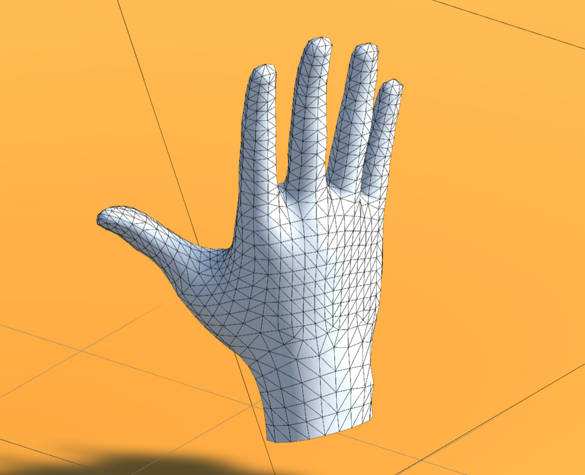
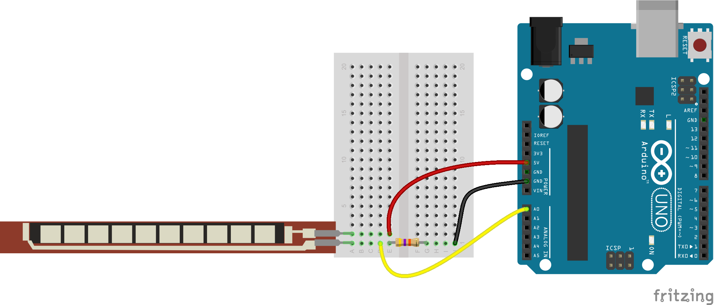

# Soft-Glove-Hand-Tracking
Human machine interface with Unity &amp; Arduino.
A simple application where you can adapt a serial data transfer from arduino to Unity and visualize it to create a human-machine interface.

Required hardwares;
  - Flex sensor.
  - Glove (x2).
  - Arduino.
  - Resistance (10K).
  - Jumper cables.

Required Unity packages;
  - Oculus integration.
  
Included documents;
  - Arduino script sensor data.
  - C# script for Unity.
  - Unity project files are not uploaded (big file size), you need to download "Oculus Integration" package from Asset store.

Remark for Oculus hand model;
  - When the Oculus hand model is downloaded, you will find the physical models under Assets>Oculus>VR>Prefabs>OVRCustomHandPrefab_R.prefab. This fbx file contains the mesh and pyhsical mdoel of a human hand, and there you will match the "Test.cs" script to this hand model (adjusting the joints with sensor data etc).

Example Set-up;

Example Circuit;

Youtube video;
xxx
